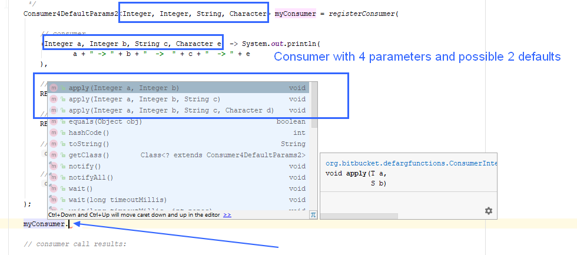

**Functions and consumers with default parameters factory**


Use this module if you need function or consumer with default parameter such as it's possible in some other programming languages.

Uses *[Type Tools](https://github.com/jhalterman/typetools)* to resolve variadic params

Uses *jUnit* for autotests

---

## Purpose

If you need function or consumer with some default parameter such as in other programming languages, for example:

Python:

```python
def a(a = 1, b = 2):
        ...
```        

C++:

```cpp
int a(int a = 1, int b = 2) 
{ 
    ...
}
```


PHP:

```php
function a(int $a = 1, int $b = 2) { 
    ... 
}

a(1);
a(1, 2)
```		
	
JAVA [ DefargFunc ]:
```java
a = Consumer2DefaultParams2<Integer, Integer> consumer = registerConsumer((var a, var str) -> { ... }, 1, 2)
a.apply(1);
a.apply(1, 2);
```

---

## Usage

You can use FuntionFactory to register function or consumer as below.

1. Consumer with *1 parameter and 1 default* value

```java
Consumer1DefaultParams1<Integer> doSomething = registerConsumer(

        // consumer
        System.out::println,

        //default param 1
        150
);

doSomething.apply(); // 150
doSomething.apply(250); // 250
```
		


2. Consumer with *2 parameters and 1 default* value
```java
Consumer2DefaultParams1<Integer, String> doSomethingElse = registerConsumer(

    // consumer
    (Integer a, String str) -> {

        // consumer body
        System.out.println(a + " - " + str);

    },

    // mark param 1 as mandatory
    REQUIRED.NO_DEFAULT,

    //default value for param 2
    "default string"
);

doSomethingElse.apply(1); // 1 - default string
doSomethingElse.apply(250, "something"); // 250 - something
```


3. Consumer with *4 parameter and 2 default* values
```java
Consumer4DefaultParams2<Integer, Integer, String, Character> myConsumer = registerConsumer(

    // consumer
    (Integer a, Integer b, String c, Character e) -> System.out.println(
            a + " -> " + b + "  ->  " + c + "  -> " + e
    ),

    // param 1 marked as mandatory
    REQUIRED.NO_DEFAULT,

    // param 2 marked as mandatory
    REQUIRED.NO_DEFAULT,

    // default value for param 3
    "default string",

    // default value for param 4
    'x'

);

// consumer call results:

myConsumer.apply(2, 3, "test", 'a');
// result: 2 -> 3  ->  test  -> a

myConsumer.apply(2, 3, "test2");
// result: 2 -> 3  ->  test  -> a

myConsumer.apply(2, 3);
// result: 2 -> 3  ->  default string  -> x
```


4. *JAVA 11* consumer example
```java
Consumer2DefaultParams2<Integer, String> doSomethingNew = registerConsumer(

        // consumer
        (var a, var str) -> {

            // consumer body
            System.out.println(a + " - " + str);

        },

        // default value param 1
        150,

        // default value param 2
        "default string b"
);

doSomethingNew.apply(); // 150 - default string b
doSomethingNew.apply(12); // 12 - default string b
doSomethingNew.apply(13, "test string"); // 13 - test string
```
		
		
		

		
5. Consumer as lambda function in class
```java
class Test{

    Consumer2DefaultParams2<Integer, String> consumer = registerConsumer(

            // consumer
            (var a, var str) -> {

                // consumer body
                System.out.println(a + " - " + str);

            },

            // default value for param 2
            14,

            // default value for param 2
            "default string b"
    );

    public Test(){
        consumer.apply(); // 14 - default string b
        consumer.apply(12); // 12 - default string b
        consumer.apply(15, "abc"); // 15 - abc
    }

}
```


---


## Type hinting

Type hinting should suggest parameter types normally in all popular IDEs. Also if you specify e.g. consumer with 4 parameters and 2 dafeults, then IDE 
should suggest function/consumer parameters (all possible signatures) corectly as below.




---

## Future, Todo

After bugfix in JDK [ JDK-8027181 ], default parameters will be provided via annotations as below.


	(var a, @def(object) var bee, @def("def string") var ster, @def(123) var number) -> { /* body */ }

